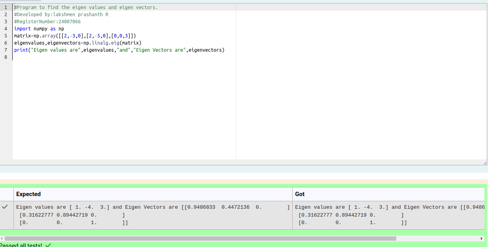

# EIGENVALUES-AND-EIGENVECTORS
## Aim:
To write a python program to find the Eigenvalues and Eigen Vectors
## Equipment’s required:
1. 	Hardware – PCs
2. 	Anaconda – Python 3.7 Installation / Moodle-Code Runner
## Algorithm:
### Step1 : import the numpy module to use the built-in function for calculation.
### Step 2: prepare the lists from each row matrix and assign in np.array().
### Step 3: Using the np.linalg.eig(),  we get two results (first is eigenvalue and second is eigenvector) of the given matrix.
### Step 4: End the programe

## Program:
````
#Program to find the eigen values and eigen vectors.
#Developed by:lakshmen prashanth R
#RegisterNumber:24007066
import numpy as np
matrix=np.array([[2,-3,0],[2,-5,0],[0,0,3]])
eigenvalues,eigenvectors=np.linalg.eig(matrix)
print("Eigen values are",eigenvalues,"and","Eigen Vectors are",eigenvectors)
````

## Output:

## Result:
Thus the Eigenvalue and Eigenvector is successfully solved using python program
